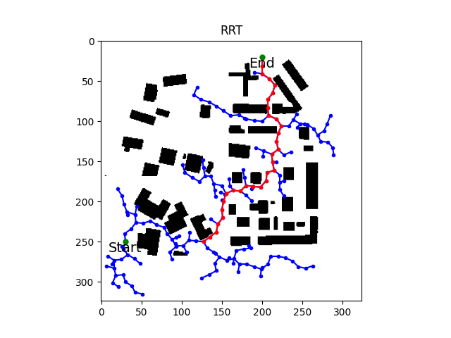
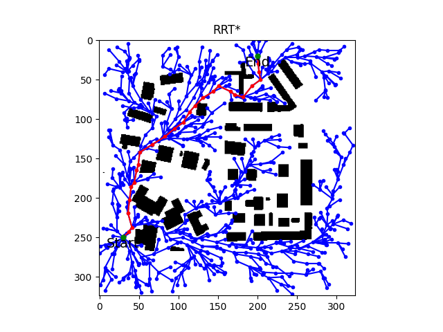
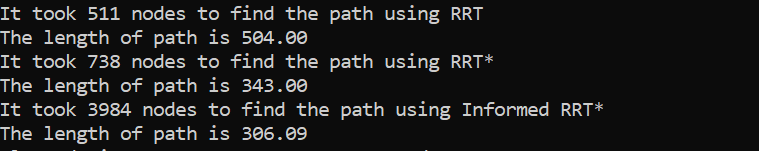

# RRT, RRT* and Informed RRT* - Robot Path Planning Algorithms for 2D Map Navigation

**Project Description:**
This project implements three popular path planning algorithms, Rapidly-Exploring Random Tree (RRT), RRT* and Informed RRT*, for 2D map navigation. The goal is to find a collision-free path between a start point and a goal point in a given map, which may contain obstacles. The algorithms work by iteratively expanding a tree-like data structure in the configuration space of the robot until the goal is reached.

**Requirements:**
- Python 3.x
- NumPy
- Matplotlib
- PIL (Python Imaging Library)

**Project Structure:**
- `main.py`: The main script to run the RRT, RRT*, and Informed RRT* algorithms and visualize the results.
- `RRT.py`: Contains the implementation of the RRTPlanner class, which defines the RRT and RRT* algorithms.
- `informed_RRTstar.py`: Contains the implementation of the Informed_RRTSTAR class, which defines the Informed RRT* algorithms
- `ASU_Map.jpg`: The input map in JPEG format.

**How to Use:**
1. Make sure you have Python 3.x installed on your system.
2. Install the required dependencies using pip:
   ```
   pip install numpy matplotlib pillow
   ```
3. Place the `main.py`, `RRT.py`, `informed_RRTstar.py`, and `ASU_Map.jpg` files in the same directory.
4. Modify the `start` and `goal` coordinates in `main.py` to match your desired start and end points on the map.
5. Run the main script using the following command:
   ```
   python main.py
   ```
6. The script will generate a visualization of the map, the RRT tree (blue lines), and the final path (red lines) if found. The start and goal points are marked with green dots.

**Implementation Details:**
1. The `load_map` function in `main.py` loads the input map, rescales it, converts it to a binary representation, and returns a 2D numpy array.
2. The `TreeNode` class in `RRT.py` and  `informed_RRTstar.py` represents a node in the RRT tree with its row and column coordinates, a parent node, and a cost.
3. The `RRTPlanner` class in `RRT.py` implements the RRT and RRT* algorithms.
4. The RRT algorithm randomly samples points in the map and extends the tree towards the sampled points until the goal is reached or the maximum number of iterations is reached.
5. The RRT* algorithm is an optimized version of RRT that rewires the tree to reduce the path length.
6. The Informed_RRTSTAR class in informed_RRTstar.py implements the Informed RRT* algorithm, an advanced version of RRT* that uses heuristics and a cost-to-go estimate to guide the sampling process towards the goal region, significantly improving convergence and optimality of the generated path.
7. The algorithms use Euclidean distance for node selection and collision checking to ensure the generated paths are collision-free.
8. The `visualize_map` function in both files generates a plot showing the map, RRT tree, and the final path (if found).

**Customization:**
- You can modify the `start` and `goal` coordinates in `main.py` to test the algorithms on different start and goal points.
- Adjust the parameters like `n_pts`, `goal_bias`, and `neighbor_size` to influence the behavior and performance of the algorithms.

**Results**

Below are the results for RRT, RRT* and Informed RRT*






### Terminal Output:




**Note:**
- The provided `ASU_Map.jpg` is used as a sample map. You can replace it with your own map by providing the file path in the `load_map` function.
- The algorithms are designed for 2D path planning and might not be directly applicable to complex 3D environments.
